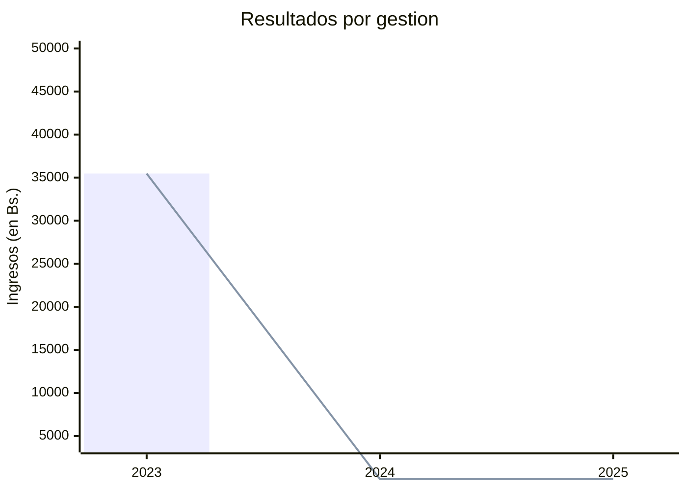

# Condominio Santa María I

Bienvenidos a la Wiki oficial del **Condominio Santa María I**. Este espacio ha sido creado con el propósito de proporcionar a los propietarios y residentes toda la información relevante relacionada con nuestra comunidad.

## Acerca del Condominio Santa María I

Ubicado en el corazón de Santa Cruz, el Condominio Santa María I ha sido hogar de muchas familias desde su fundación. Con una estructura arquitectónica moderna y áreas comunes diseñadas para el disfrute de todos, nuestra comunidad se enorgullece de ofrecer un ambiente seguro y armonioso para todos sus residentes.

## Contenidos de la Wiki

1. **Estado Financiero:**

2. **Normativas y Reglamentos:** Información sobre las reglas de convivencia, uso de áreas comunes y otros aspectos relevantes.
    - [Reglamento](https://github.com/Condominio-Santa-Maria/.github/wiki/Reglamento)
    - [Manual de funciones](https://github.com/Condominio-Santa-Maria/.github/wiki/ManualFunciones)

3. **Telefonos de contacto emergencia:** Información sobre los proveedores de diferentes servicios.
    - [Listado de contactos de emergencia](https://github.com/Condominio-Santa-Maria/.github/wiki/ContactosEmergencia)
     
4. **Servicios:** Información sobre los servicios que brinda el Condominio Santa María1. 
    - [CRE](https://github.com/Condominio-Santa-Maria/.github/wiki/CRE)
    - [SAGUAPAC](https://github.com/Condominio-Santa-Maria/.github/wiki/SAGUAPAC)
    - [ENTEL](https://github.com/Condominio-Santa-Maria/.github/wiki/ENTEL)
    - [Aquacenter](https://github.com/Condominio-Santa-Maria/.github/wiki/Aquacenter)
    - [INTERLOGI](https://github.com/Condominio-Santa-Maria/.github/wiki/INTERLOGI)
    - [Administración](https://github.com/Condominio-Santa-Maria/.github/wiki/Administracion)
    - [CleaningFull](https://github.com/Condominio-Santa-Maria/.github/wiki/CleaningFull)
    - [Portería](https://github.com/Condominio-Santa-Maria/.github/wiki/Portería)
    - [Jardinería](https://github.com/Condominio-Santa-Maria/.github/wiki/Jardinería)

5. **Directorio:** Encuentra información de contacto de la directiva y administración del condominio.
    - [Roy Ruddy Paz Demiquel (Presidente)](https://github.com/Condominio-Santa-Maria/.github/wiki/102)
    - [Mauro Hurtado (Vicepresidente)](https://github.com/Condominio-Santa-Maria/.github/wiki/Vicepresidente)
    - [Ursula Echazú (Tesorera)](https://github.com/Condominio-Santa-Maria/.github/wiki/Tesorero)

6. **Eventos y Anuncios:** Mantente al día con las últimas noticias y eventos de la comunidad.
    - [Asambleas](https://github.com/Condominio-Santa-Maria/.github/wiki/Asambleas)
    - [Incidencias](https://github.com/Condominio-Santa-Maria/.github/wiki/Incidencias)

7. **Proyectos y Mejoras:** Información sobre las propuestas y proyectos en marcha para el beneficio del condominio.
    - [26/07/2023 (Personeria Juridica)](https://github.com/Condominio-Santa-Maria/.github/wiki/PersoneriaJuridica)
    - [26/07/2023 (Pintado)](https://github.com/Condominio-Santa-Maria/.github/wiki/Pintado26072023)
    - [26/07/2023 (Cambio de Guardias)](https://github.com/Condominio-Santa-Maria/.github/wiki/CambioGuardias26072023)

8. **Informes Econónimcos:** Información del estado financiero del condominio.
    - [Gestión 2025](https://github.com/Condominio-Santa-Maria/.github/wiki/InformeEconómico2025)
    - [Gestión 2024](https://github.com/Condominio-Santa-Maria/.github/wiki/InformeEconómico2024)
    - [Gestión 2023](https://github.com/Condominio-Santa-Maria/.github/wiki/InformeEconómico2023)

Te invitamos a explorar esta wiki que nos ayuda fortaleciendo el sentido de comunidad y mejorando la vida en el Condominio Santa María I. Si tienes alguna sugerencia o información para agregar, no dudes en contactar a la administración.

